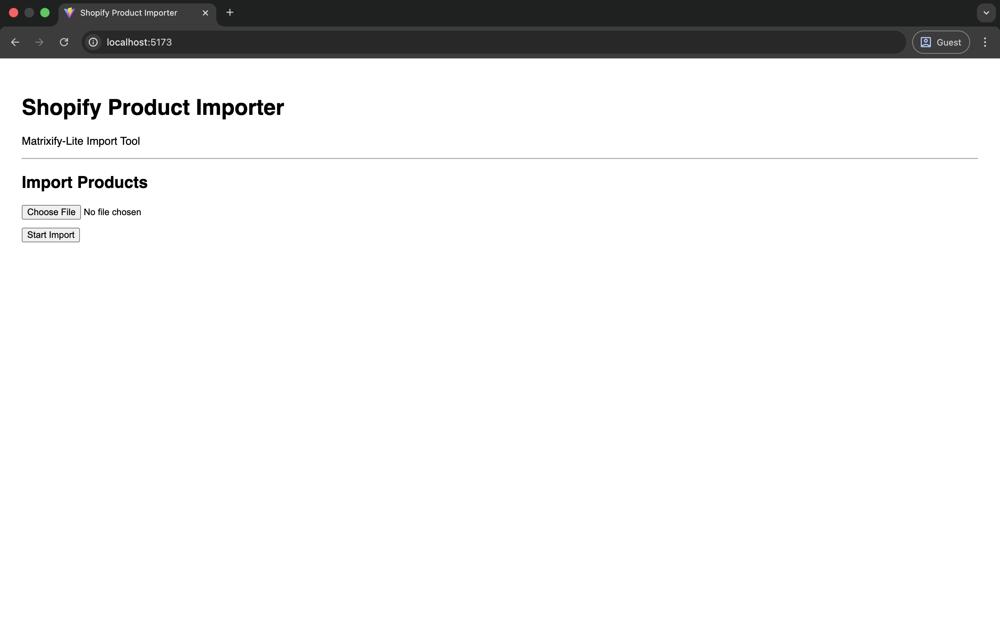
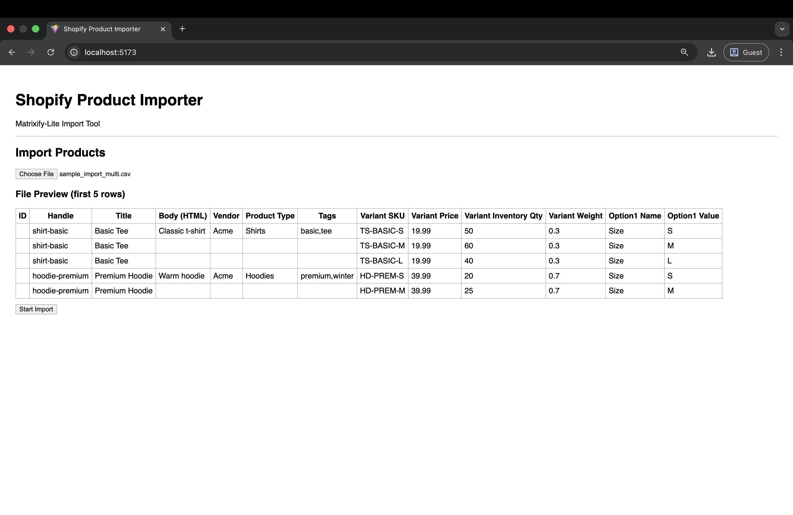
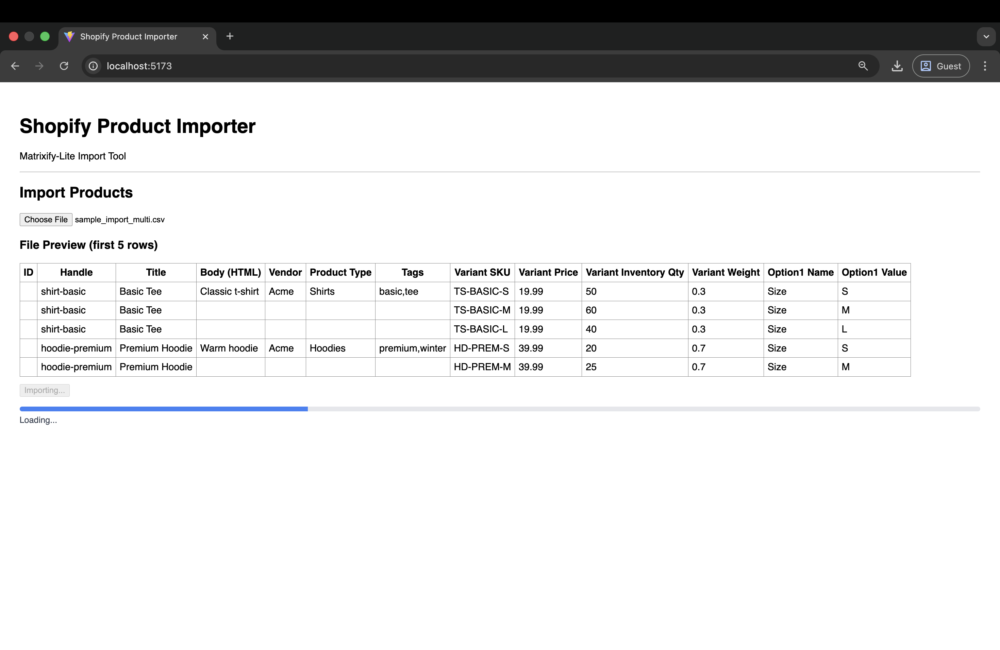
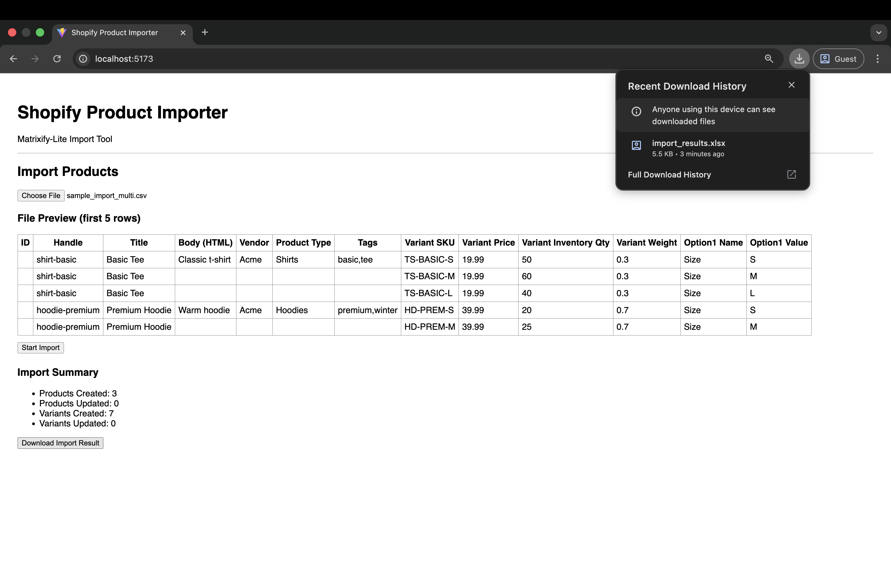
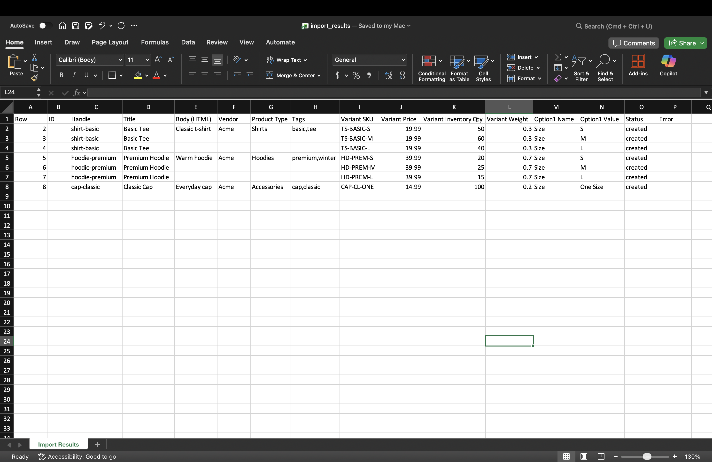

# Shopify Product Importer

A full‑stack application to import products and variants into Shopify using CSV or Excel files, with validation, duplicate detection, and downloadable import results.

---

## Features

- Upload CSV / XLSX product files  
- Preview file data before import  
- Normalize and validate product + variant data  
- Prevent duplicate SKUs 
- Merge or create products intelligently  
- Track per‑row import status (created / updated / skipped / error)  
- Download Excel import result report  
- Frontend progress tracking  
- Backend validation with clear error messages  

---

## Tech Stack

### Backend
- **FastAPI** (Python)
- **OpenPyXL** (Excel handling)
- **HTTPX** (Shopify API client)
- **Shopify Admin REST API** (2024‑01)
- Temporary file storage (`/tmp`)
- Modular architecture:
  - `parser`
  - `validator`
  - `grouper`
  - `merge service`

### Frontend
- **React**
- **Fetch API**
- **PapaParse** (CSV preview)
- **SheetJS / XLSX** (Excel preview)
- Plain CSS

---

## Assumptions

- Each variant row **must have a SKU**
- A product must have **at least one of**:
  - `Handle`
  - `Title`
- Multiple rows with the same handle/title represent variants of the same product
- Duplicate SKUs **within the same file** are skipped

---

## Import Flow (High Level)

1. User uploads CSV/XLSX  
2. File preview shown (first 5 rows)  
3. Backend parses file → normalized rows  
4. Rows grouped into products + variants  
5. Validation runs:
   - Missing handle/title
   - Duplicate SKUs
   - Invalid fields
6. Valid products are created/updated in Shopify  
7. Per‑row result is stored  
8. User downloads Excel import result  

---

## Schema / Field Mapping

### Product Fields

| Import Column     | Shopify Field          |
|------------------|------------------------|
| ID               | product.id             |
| Handle           | product.handle         |
| Title            | product.title          |
| Body (HTML)      | product.body_html      |
| Vendor           | product.vendor         |
| Product Type     | product.product_type   |
| Tags             | product.tags           |

### Variant Fields

| Import Column             | Shopify Field              |
|--------------------------|----------------------------|
| Variant SKU              | variant.sku                |
| Variant Price            | variant.price              |
| Variant Inventory Qty    | variant.inventory_quantity |
| Variant Weight           | variant.weight             |
| Option1 Name             | option name (e.g. Size)    |
| Option1 Value            | variant.option1            |


---

## Example Import File Template

### CSV

```csv
ID,Handle,Title,Body (HTML),Vendor,Product Type,Tags,Variant SKU,Variant Price,Variant Inventory Qty,Variant Weight,Option1 Name,Option1 Value
,shirt-basic,Basic Tee,Classic t-shirt,Acme,Shirts,"basic,tee",TS-BASIC-S,19.99,50,0.3,Size,S
,shirt-basic,Basic Tee,,,,TS-BASIC-M,19.99,60,0.3,Size,M
,shirt-basic,Basic Tee,,,,TS-BASIC-L,19.99,40,0.3,Size,L
```
---

## UI Screenshots – Import Flow
#### User selects a product file to start the import.




#### File Preview (First 5 Rows)
Preview of product and variant data before import.



#### Import in Progress
Real-time progress indicator during Shopify import.




#### Import Summary
Summary of created products and variants.



#### Download Result
Excel result download



---
## Setup Instructions
### Backend
cd backend
python -m venv venv
source venv/bin/activate
pip install -r requirements.txt
uvicorn app.main:app --reload

##### Create .env file:

SHOPIFY_STORE_URL=your-store.myshopify.com
SHOPIFY_ACCESS_TOKEN=your-access-token
SHOPIFY_API_VERSION=2024-01

### Frontend
cd frontend
npm install
npm run dev
